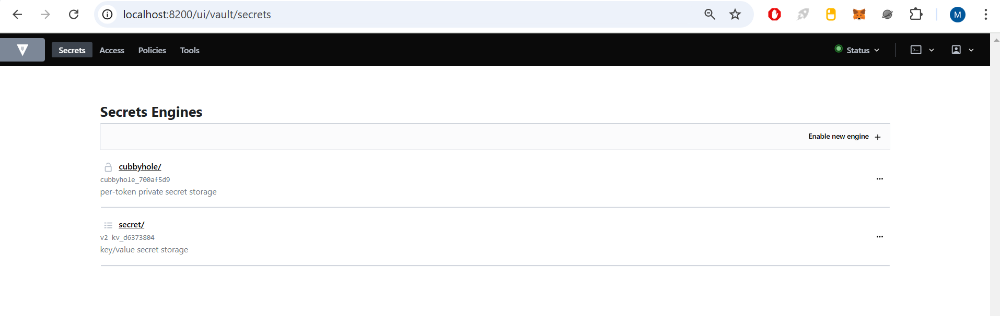

University: [ITMO University](https://itmo.ru/ru/)

Faculty: [FICT](https://fict.itmo.ru)

Course: [Introduction to distributed technologies](https://github.com/itmo-ict-faculty/introduction-to-distributed-technologies)

Year: 2024/2025

Group: K4110c

Author: Mikhaylova Maria Sergeevna

Lab: Lab1

Date of create: 23.12.2024

Date of finished: 23.12.2024

---
## Описание

Это первая лабораторная работа в которой вы сможете протестировать Docker, установить Minikube и развернуть свой первый "под".

## Цель работы

Ознакомиться с инструментами Minikube и Docker, развернуть свой первый "под".

## Ход работы

### Подготовка среды

1. Установить [Docker](https://www.docker.com/);
2. Установить `Minikube` согласно [инструкции](https://minikube.sigs.k8s.io/docs/start/?arch=%2Fwindows%2Fx86-64%2Fstable%2F.exe+download);
3. Установить [kubectl](https://kubernetes.io/ru/docs/tasks/tools/install-kubectl/)

### Запуск Minikube

После установки был развернут minikube cluster с помощью команды:

```bash
minikube start
```

После запуска `minikube cluster` можно взаимодействовать с k8s используя команду:

```bash
minikube kubectl
```

### Манифест для развертывания

Для первого манифеста был выбран образ `HashiCorp Vault`.

Был создан файл `vault.yaml`:

```yaml
apiVersion: v1
kind: Pod
metadata:
  name: vault
  labels:
    name: vault
spec:
  containers:
  - name: vault
    image: vault:1.9.3
    ports:
    - containerPort:  8200
```
### Запуск сервиса

Для создания пода воспользуемся командой:

```bash
kubectl apply -f vault.yml
```

Для сервиса воспользуемся командой:

```bash
minikube kubectl -- port-forward service/vault 8200:8200
```

Чтобы прокинуть порт компьютера в контейнер:

```bash
minikube kubectl -- port-forward service/vault 8200:8200
```
В результате получим:


### Результат работы

Перейдем на [http://localhost:8200/](http://localhost:8200/):


Посмотрим логи с помощью команды и возьмем токен для авторизации:

```bash
kubectl logs vault
```

После введение токена авторизации получаем:



## Итоги работы 

В ходе лабораторной работы были приобретены навыки работы с инструментами Minikube и Docker, а также был развернут Vault под.

## Ответы на вопросы

`minikube kubectl -- expose pod vault --type=NodePort --port=8200`
Эта команда создала объект Service для Pod-а с именем vault, указав, что доступ к нему будет возможен через NodePort. NodePort автоматически назначает порт на ноде, через который можно обращаться к сервису извне кластера.

`minikube kubectl -- port-forward service/vault 8200:8200`
Эта команда настроила перенаправление порта, она связывает порт 8200 компьютера с портом 8200 сервиса Vault внутри кластера. После можно обращаться к Vault через http://localhost:8200 из браузера на компьютере.

Схема организации контейнеров и сервисов:

