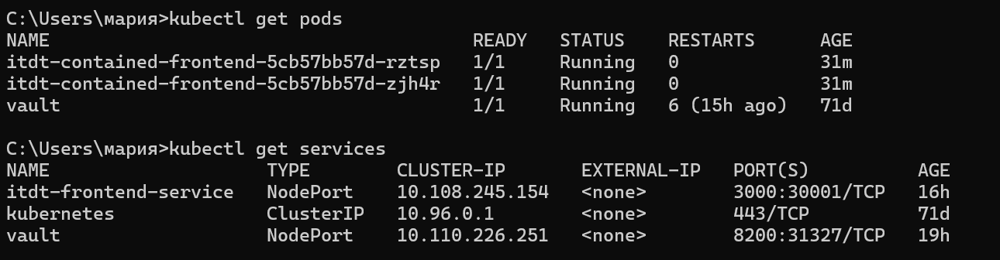
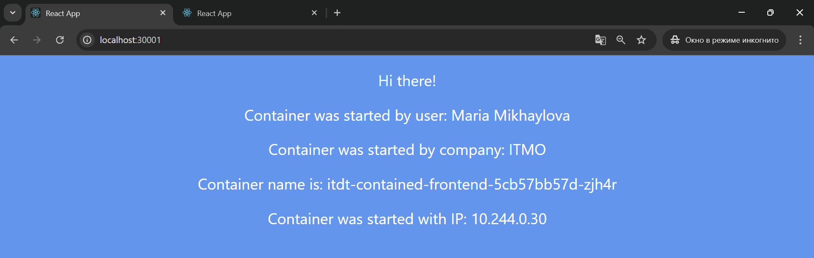
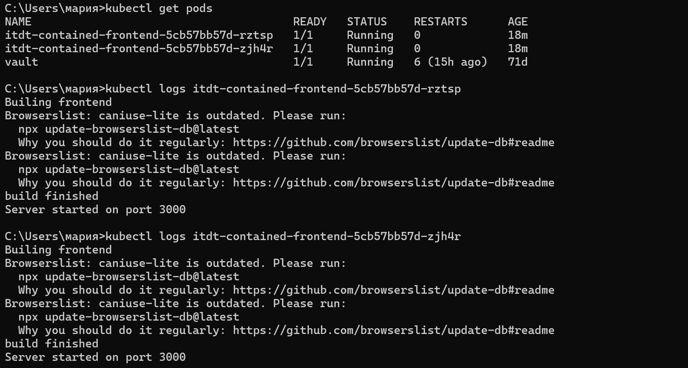
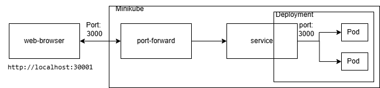

University: [ITMO University](https://itmo.ru/ru/)

Faculty: [FICT](https://fict.itmo.ru)

Course: [Introduction to distributed technologies](https://github.com/itmo-ict-faculty/introduction-to-distributed-technologies)

Year: 2024/2025

Group: K4110c

Author: Mikhaylova Maria Sergeevna

Lab: Lab2

Date of create: 23.12.2024

Date of finished: 23.12.2024

---
## Описание

В данной лабораторной работе вы познакомитесь с развертыванием полноценного веб сервиса с несколькими репликами.

## Цель работы

Ознакомиться с типами "контроллеров" развертывания контейнеров, ознакомится с сетевыми сервисами и развернуть свое веб приложение.

## Ход работы
Создим deployment с 2 репликами контейнера `ifilyaninitmo/itdt-contained-frontend:master` и передадим переменные `REACT_APP_USERNAME`, `REACT_APP_COMPANY_NAME` в эти реплики:

```yaml
apiVersion: apps/v1
kind: Deployment
metadata:
  name: itdt-contained-frontend
  labels:
    name: itdt-contained-frontend
spec:
  replicas: 2
  selector:
    matchLabels:
      app: itdt-contained-frontend
  template:
    metadata:
      labels:
        app: itdt-contained-frontend
    spec:
      containers:
        - name: itdt-contained-frontend
          image: ifilyaninitmo/itdt-contained-frontend:master
          env:
            - name: REACT_APP_USERNAME
              value: "Maria Mikhaylova"
            - name: REACT_APP_COMPANY_NAME
              value: "ITMO"
          ports:
            - containerPort: 3000
```
Создадим сервис через который будет доступ на эти "поды":

```yaml
apiVersion: v1
kind: Service
metadata:
  name: itdt-frontend-service
  labels:
    app: itdt-frontend
spec:
  selector:
    app: itdt-frontend
  ports:
    - protocol: TCP
      port: 3000
      targetPort: 3000
      nodePort: 30001
  type: NodePort
```

Применяем созданные манифесты c помощью команд:

```bash
kubectl apply -f deployment.yaml
kubectl apply -f service.yaml
```
Проверить, что поды и сервис работают:

```bash
kubectl get pods
kubectl get services
```


Были проброшены порты с помощью команды:

```bash
kubectl port-forward service/itdt-contained-frontend 30001:3000
```

Перейдем на [localhost:30001/](http://localhost:30001/):



Заметим, что переменные `REACT_APP_USERNAME`, `REACT_APP_COMPANY_NAME` соответствуют указанным

Логи контейнеров:



## Итоги работы 

В ходе лабораторной работы были изучены типы "контроллеров" развертывания контейнеров, сетевые сервисы и было развернуто свое веб приложение.

## Ответы на вопросы

Схема организации контейнеров и сервисов:

